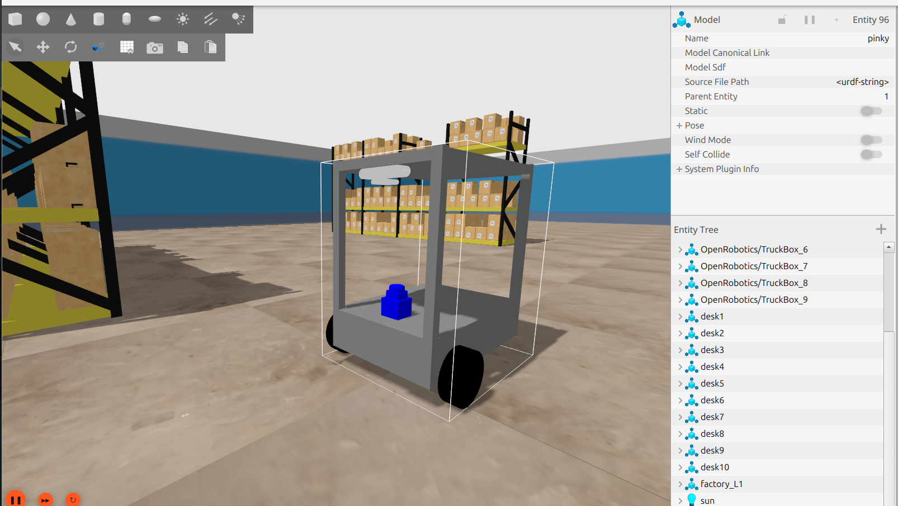
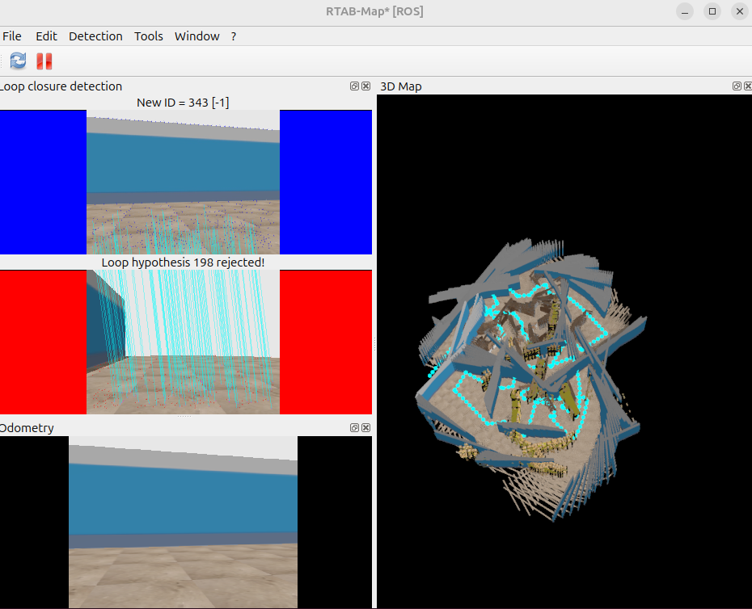
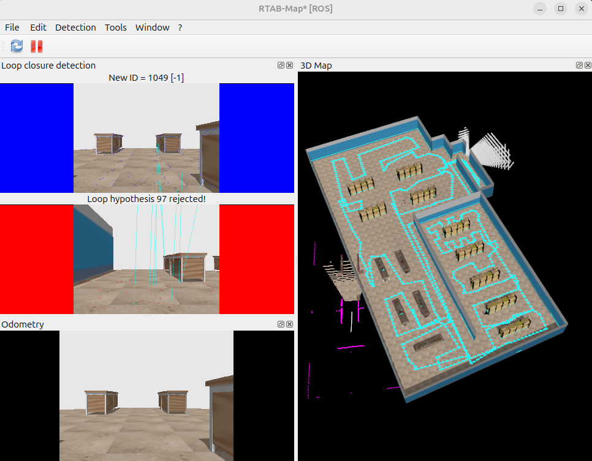

# Vic Pinky VSLAM
### Pinklab에서 만든 Vic Pinky를 활용하여 Depth 카메라와 RTAB-Map SLAM을 구현한 프로젝트입니다. 


---

## 1. 프로젝트 목표

이번 프로젝트에서는 Gazebo에서 Depth 카메라를 추가하고 RTAB-Map SLAM을 활용하여 실시간 지도 작성 및 자율 주행을 구현


## 2. 프로젝트 과정

### 1. Depth 카메라 urdf 추가
1. orbbec astra 카메라 가제보모델을 gazebo.fuel에서 다운
2. camera.xacro 및 robot_core.xacro에 링크 및 설정 추가
3. vicpinky_gazebo/params/pinky_bridge.yaml depth카메라 토픽 추가



---

### 2. RTAB-Map SLAM 구현
1. sudo apt install ros-$ROS_DISTRO-rtabmap-ros 설치
2. vicpinky_navigation/launch/rtabmap_rgbd.launch.xml 파일 추가 
3. 공식 예제를 참고하여 rtabmap_rgbd.launch.xml파일작성
[공식 깃허브](https://github.com/introlab/rtabmap_ros)


### 3. 문제점

1. depth 단일로만 rtamp_slam을 실행시 맵이 꼬이는 현상이 발생 
2. 단순한 맵에서 시각적특징 추출의 어려움으로 오차가 누적되어 맵이 이상해지는걸로 예상




---

### 4. 개선 방법


1. depth와 2d lidar의 센서 데이터를 융합하는 방식으로 변경
2. vicpinky_navigation/launch/rtabmap_rgbd_lidar.launch.xml 파일 추가 
3. 정확도가 월등히 좋아짐.



---

## 2. 설치 및 빌드

### PC 설정
1. **환경**: Ubuntu 24.04, ROS2 Jazzy
2. **패키지 클론**:
   ```bash
   mkdir -p ~/dev_ws
   cd ~/dev_ws
   git clone git@github.com:jongbob1918/vic_pinky_VSLAM.git
   ```
3. **의존성 설치**:
   ```bash
   cd vicpinky_VSLAM
   rosdep install --from-paths src --ignore-src -r -y
   ```
4. **빌드**:
   ```bash
   cd vicpinky_VSLAM
   colcon build
   source ./istall/setup.bash
   ```


## 2. 사용 방법

### Depth 카메라 RTAB-Map SLAM 실행
1. **로봇 실행**:
   ```bash
   ros2 launch vicpinky_bringup bringup.launch.xml use_sim_time:=True
   ```
2. **SLAM 실행**:
다른 터미널 열기
   ```bash
   source ./istall/setup.bash
   ros2 launch vicpinky_navigation rtabmap_rgbd.launch.xml
   ```
   
3. **키보드 조작 실행**:
다른 터미널 열기
   ```bash
   source ./istall/setup.bash
   ros2 run teleop_twist_keyboard teleop_twist_keyboard 
   
   ```

### 키보드 조작 안내 표

| 키 | 동작 |
|----|------|
| `u` | 좌측 상단 이동 |
| `i` | 전진 |
| `o` | 우측 상단 이동 |
| `j` | 좌측 이동 |
| `k` | 정지 |
| `l` | 우측 이동 |
| `m` | 좌측 하단 이동 |
| `,` | 후진 |
| `.` | 우측 하단 이동 |
| `t` | 위로 이동 (+z) |
| `b` | 아래로 이동 (-z) |
| `q`/`z` | 최대 속도 증가/감소 (10%) |
| `w`/`x` | 직진 속도만 증가/감소 (10%) |
| `e`/`c` | 회전 속도만 증가/감소 (10%) |

**Holonomic 모드 (스트레이프 이동)**: Shift 키를 누른 상태에서 위의 키를 사용하세요.

   
5. **지도 저장**:
다른 터미널 열기
   ```bash
   ros2 run nav2_map_server map_saver_cli -f <map_name>
   ```


### Depth 카메라, 2D-LIDAR 기반 RTAB-Map SLAM 실행

1. **로봇 실행**:
   ```bash
   ros2 launch vicpinky_bringup bringup.launch.xml use_sim_time:=True
   ```
2. **SLAM 실행**:
다른 터미널 열기
   ```bash
   source ./istall/setup.bash
   ros2 launch vicpinky_navigation rtabmap_rgbd_lidar.launch.xml
   ```
   
3. **키보드 조작 실행**:
다른 터미널 열기
   ```bash
   source ./istall/setup.bash
   ros2 run teleop_twist_keyboard teleop_twist_keyboard 
   
   ```

---
### Gazebo 맵 변경 하고싶을 때 
   ```bash
cd vic_pinky_VSLAM/src/vicpinky_gazebo/launch/launch_sim.launch.xml
code .
   
   ```


   ```bash
<arg name="world_name" default="factory_L1.world"/>
해당 부분을 (addinedu_map.world, factory_L1.world,empty.world ) 중 하나로 변경
   
   ```
터미널에서

   ```bash
colcon build
source ./install/setup.bash
   
   ```
---

###  맵 저장 
db에 자동저장
db에서 열기

 ```bash
   # 데이터베이스 확인
ls -lh ~/.ros/rtabmap.db

# 데이터베이스 뷰어로 열기
rtabmap-databaseViewer ~/.ros/rtabmap.db
   ```

### 2D Occupancy Grid 저장 
RTABMAP이 발행하는 /map 토픽을 pgm/yaml 형식으로 저장
 ```bash
# RTABMAP 실행 중에
ros2 run nav2_map_server map_saver_cli -f ~/my_map
   ```


### Navigation 실행
1. **Navigation2 실행**:
   ```bash
   ros2 launch vicpinky_navigation bringup_launch.xml map:=<map_name>
   ```


### 문의 사항 
#### 📧  mail : jongbob1918@gmail.com
